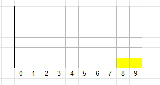

# Tetris

## The problem

Build a small Tetris engine according to the following specification:
1. The program returns the height of the tallest column.
   - The program reads the sequence of pieces from an input file.
   - The input file format: `I0,I4,Q8` (piece I at index 0, another Piece I at 4, and a Piece Q at 8.
2. The grid width is fixed at 10 units.
3. The grid expands vertically as needed.
4. The following set of pieces are available:

4. As in the original game, filled lines disappear. For instance:

(Output: 1)

5. However, when intermediary filled lines disappear, pieces are not moved to the bottom. Therefore  configurations like the one below are allowed: 

6. The example below returns 4 (height of tallest column):

## The solution

- Created a two-dimensional array in NumPy
- Created Piece objects to hold the physical configuration of each piece, as well as invisible points.
- Used NumPy's `logical_and()`and `logical_or()` functions to detect collisions smoothly. Collisions are easier with Z and S pieces.
- Used NumPy's advanced slicing to retrieve correct expected position of new piece.
- Used NumPy's `nditer` context manager to write to correctly write pieces. Invisible points are masked out (otherwise these would replace existing points).

For debugging purposes, `print` statements have not been ommitted.

## Requirements:
- `Python` 3.7
- `numpy` 1.21.6

## Execution instructions
- `python tetris.py input.txt output.txt`

## Notes
- For debugging purposes, `print`statements were not removed.
- Tested up to 50 pieces
- Grid expands up to 100+ lines upward